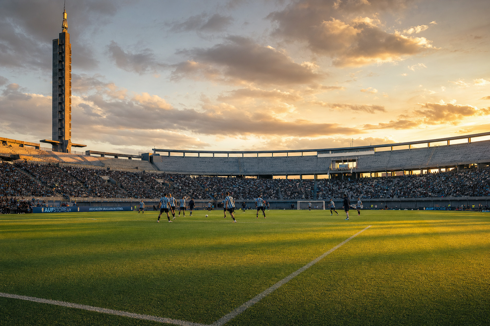

# אורוגוואי לקראת מונדיאל 2026: דור חדש, רעב ישן לזכייה

בשנת 1930 עלה הווילון לראשונה על גביע העולם — ואורוגוואי הייתה שם, עם הגביע בידיים. עשרים שנה אחר כך, ב-1950, חזרה ועשתה את הבלתי ייאמן: ניצחה את ברזיל בביתה, במה שייזכר לנצח כ"מאראקנאסו". מאז חלפו עשרות שנים, שבעה גביעי קופה אמריקה נוספו לארון הכבוד (15 בסה"כ, שיא עולמי), אבל הגביע הגדול נותר שם — בתוך הגביע עצמו, מחוץ להישג יד.

קיץ 2026. המונדיאל חוזר לאמריקה הצפונית, ואורוגוואי מגיעה עם מנהל חדש, דור חדש, ועם אותו הרעב שליווה אותה מאז ומתמיד.

---

## ביאלסה בפיקוד: לחץ, אינטנסיביות, ואמונה בנוער

מרסלו ביאלסה אינו מאמן רגיל. האיש שעיצב דורות של כדורגל בארגנטינה, צ'ילה ואתלטיק בילבאו, הגיע לנבחרת האורוגוואית ב-2023 עם שליחות ברורה: לבנות צוות שמשחק בלחץ גבוה, רץ יותר, חושב מהר יותר, ומוכן לקחת את הסיכונים שנבחרות "שמרניות" מסרבות לקחת.

התוצאות בהכשרות דיברו בעד עצמן. ביאלסה הוביל את אורוגוואי לניצחונות מרשימים על ברזיל ועל ארגנטינה — שני הקולוסים של אמריקה הדרומית — ובנה קבוצה שמגיעה לצפון אמריקה עם ביטחון עצמי ולא עם כניעה מראש.

אבל ביאלסה הוא גם אדם של עקרונות. והעיקרון הראשון שלו: אם אינך משחק, אינך מגיע.

---

## עננה בשמי הסלסטה: דארווין נונז ושאלת הדקות

כאן מגיעה הסיפור המסובך של הסלסטה לקראת המונדיאל.

דארווין נונז, 26, אמור להיות חוד החנית של אורוגוואי. חלוצה הקשה, המהיר, בעל ניסיון ביג-ליג שצבר בשנותיו בליברפול. אבל בקיץ 2025 עבר לאל-הילאל הסעודית, ושם הסתבכו הדברים. עם הגעת בנזמה הצרפתי, מגבלות על שחקנים זרים בליגה הסעודית הותירו את נונז מחוץ לרשימה הקבוצתית לליגה — הוא משחק רק בליגת האלופות האסייתית.

23 הופעות, 1,577 דקות, 7 שערים — זה לא מספיק. ביאלסה, שמקדש כושר גופני ורצף משחקים, כבר איתת חוסר שביעות רצון. אם נונז לא יגיע בכושר מלא ליוני, הוא עלול למצוא את עצמו על הספסל — או אפילו מחוץ לסגל. לגבי קבוצה שמבנה ההתקפה שלה מושתת על הדינמיות שלו, זו בעיה אמיתית.

---

## עמוד השדרה שמחזיק את הכל

גם אם נונז ייאלם, הנבחרת האורוגוואית רחוקה מלהיות חסרת כלים.

**פדריקו ולבארדה** (ריאל מדריד, 71 כיסויים) הוא כנראה שחקן הביניים הטוב בעולם כיום — כוח פיזי, חשיבה מהירה, ויכולת להיות גורם מכריע גם בהגנה וגם בהתקפה. **חוסה מריה ז'ימנז** (אטלטיקו מדריד, 97 כיסויים) מוביל את קו ההגנה עם הניסיון של מונדיאל שלישי בכיסו. ו**רונלד אראוחו** (ברצלונה) משלים את צמד הסנטרבקים עם אגרסיביות ויכולת אוויר נדירות.

מאחוריהם, **מתיאס אוליברה** (נאפולי) מגן על השמאל ומציע איום התקפי תמידי. הנבחרת בנויה, ומי שחושב שהדור הסיים עם פרישתם של סוארס וקאבאני — צפוי להתפכח.

---

## קבוצת ה': בין קפיצת הדרגה לפח

הגרלת המונדיאל הציבה את אורוגוואי בקבוצה ח' — עם **ספרד**, **כף ורדה** ו**ערב הסעודית**.

ספרד היא המועדפת הגדולה בקבוצה — אחת הנבחרות העמוקות ביותר באירופה כרגע. כף ורדה, למרות שמה הצנוע, הפתיעה בעשור האחרון ואינה "ניצחון מובטח". ערב הסעודית מכירה לאורוגוואי מהמחנות הבינלאומיים, אבל ביאלסה ודאי אינו מוכן לדרמות של ארגנטינה-ערב הסעודית מ-2022.

לוח המשחקים: ערב הסעודית ב-16 ביוני במיאמי, כף ורדה ב-22 ביוני במיאמי, ספרד ב-27 ביוני בגוודלחרה. המשחק האחרון הוא זה שיקבע — אם אורוגוואי רוצה לצאת מהבית בראש, תצטרך לעמוד מול הספרדים.

---

## מה שמחכה מעבר לבית

ההיסטוריה מלמדת שאורוגוואי תמיד מפתיעה בשלבי הנוק-אאוט. ב-2010 הגיעו לחצי גמר בדרום אפריקה. ב-2018 הגיעו לרבע גמר. הם לא מגיעים כ"מפחידים" — הם מגיעים כ"מכאיבים".

אם נונז יגיע בכושר, אם ביאלסה ישמור על הסגנון שעבד בהכשרות, ואם קו ההגנה ישמור על הצורה שמוכרת מהקלאסיקו האורוגוואי — יש לסלסטה כל הסיבות להחלים מ-76 שנות המתנה.

הגביע הגדול עדיין שם, ממתין. ואורוגוואי, כמו תמיד, יודעת לחכות.

---

*מקורות: FIFA, FOX Sports, OneFootball, FourFourTwo, וואלה ספורט*
