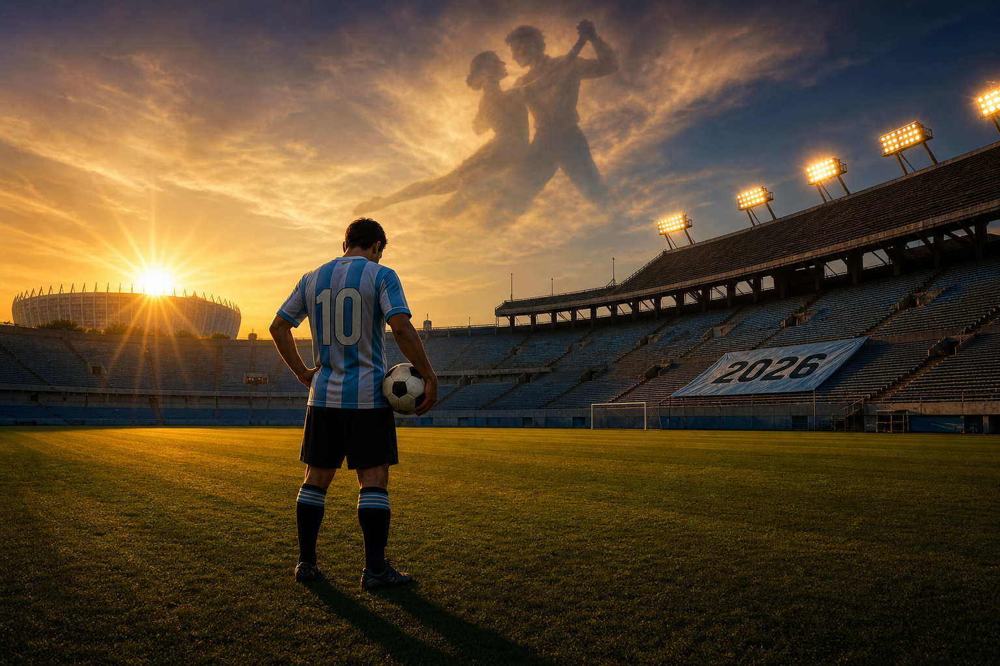

# הריקוד האחרון: ארגנטינה לפני המונדיאל ה-23 של מסי

שלוש זכיות במונדיאל. שש הופעות בגמר. ושחקן אחד בן 38 שעדיין לא אמר לא.

ב-2026 ארגנטינה חוזרת לטורניר כאלופה המכהנת, עם כתר נוסף בקופה אמריקה ועם דמות אחת שמרחפת מעל הכל: ליונל מסי, שאומר "יום-יום" אבל אדידס כבר משווקת לו את הנעל בשם "El Último Tango".

## עבר: שלושה כתרים, שלוש דמויות

ארגנטינה לא מתחילה את הסיפור שלה ב-2022. היא רק סיימה שם פרק.

הפרק הראשון נכתב ב-1978, בבית. ססאר לואיס מנוטי על הספסל, מריו קמפס על החוד, גמר 3:1 על הולנד אחרי הארכה. נעל הזהב לקמפס עם 6 שערים. דייגו מראדונה, הילד של 17, נשאר מחוץ לסגל בגלל גילו, וזה היה הוויכוח של אותה שנה. ארגנטינה לא התעניינה. היא לקחה את הכוכב הראשון.

שמונה שנים אחר כך, מקסיקו 1986, מראדונה היה הטורניר. שני שערים מול אנגליה ברבע הגמר, אחד עם היד ואחד עם 60 מטרים של ריצה. גמר 3:2 מול מערב גרמניה. כדור זהב. כוכב שני. אם 1978 הייתה הוכחה שאפשר, 1986 הייתה הוכחה שיש מי.

ב-1990 ארגנטינה חזרה לגמר והפסידה לאותה גרמניה. ב-2014, במראקנה, גרמניה ניצחה שוב, 1:0 בהארכה, מסירה של אנדרה שרלה לגוטצה בדקה ה-113. ב-2018 צרפת הוציאה את ארגנטינה כבר בשמינית. שלושה דורות שניסו ולא הצליחו לסגור.

ואז 2022. קטאר. הגמר מול צרפת שכבר הפך לחלק מהמיתוס: 2:0 לארגנטינה, מבאפה משווה בתשעים שניות, 3:3 בהארכה, 4:2 בפנדלים. דמבלה מפיל את די מריה לפנדל הראשון. מסי כובש פעמיים. אמיליאנו מרטינס עוצר את הפנדל של קומאן. גונסאלו מונטיאל מכריע. הכוכב השלישי. הכתר שמסי חיכה לו 16 שנה.

## קופה אמריקה: השושלת שעקפה את אורוגוואי

בין 1993 ל-2021 ארגנטינה לא לקחה תואר בכיר. 28 שנה של גמרים אבודים, פנדלים מוחמצים, מסי שהתפטר ב-2016 וחזר אחרי כמה חודשים. השיא של התסכול.

ב-2021 הגיע הפיצוץ. גמר במראקנה מול ברזיל. שער יחיד של אנחל די מריה ב-22, צ'יפ מעל אדרסון, 1:0. התואר הראשון של מסי עם הסגל הבוגר, על המגרש של ה-1950 הברזילאי. שנה אחר כך, פיינליסימה בוומבלי: 3:0 על איטליה אלופת אירופה, עם לאוטארו, די מריה, ופאולו דיבאלה. 2024, בגמר קופה אמריקה במיאמי, לאוטארו מרטינס כבש בדקה ה-112 מול קולומביה. 1:0 בהארכה. תואר 16 בקופה אמריקה.

זאת הנקודה שבה ארגנטינה עברה את אורוגוואי (15) ברשימת הזוכות בכל הזמנים. אחרי עשורים שבהם הסלסטה החזיקה ביבשת, האלביסלסטה לקחה את הכותרת.

באותו ערב במיאמי, די מריה שיחק את משחקו האחרון בנבחרת. 144 הופעות, 31 שערים, ושותף לכל שלושת התארים הגדולים. "אני לא מוכן למשחק האחרון שלי, אבל הגיע הזמן," אמר לפני המשחק. הוא יצא בכבוד. מסי נשאר.

## הווה: סקאלוני, סגל בוגר, כוכב אחד שדוחק את החלטה

ליונל סקאלוני האריך ב-2023 חוזה עד מונדיאל 2026. הוא לא רק החזיק את מה שזכה ב-2022, הוא בנה עליו. ארגנטינה סיימה את מוקדמות CONMEBOL במקום הראשון, 38 נקודות מ-18 משחקים, 12 ניצחונות, 31 שערים, 10 ספגה. אקוודור במקום השני עם 29. ההפרש מדבר.

הסגל שיגיע לקיץ הוא שילוב של גרעין-2022 שהתבגר ושכבה צעירה שגדלה מסביבו.

**אמיליאנו "דיבו" מרטינס** ממשיך לעמוד בשער אסטון וילה ובשער הנבחרת. הגיבור של פנדלי קטאר. **קריסטיאן "קוטי" רומרו** ו**ליסנדרו מרטינס** הם קו הגנה אגרסיבי, נוקשה, שלא נותן מטר. **ניקולאס אוטמנדי** עדיין בסביבה, **נאוול מולינה** על הימני.

באמצע, **רודריגו דה פאול** הוא המנוע הוורבלי. **אלכסיס מק אליסטר** (ליברפול) הוא הכוח הטכני, ו**אנסו פרננדס** (צ'לסי) הוא הקישור היצירתי. **ג'ובאני לו סלסו** נכלל ברשימה המקדימה למרות פציעה, סקאלוני בוחר בו על האמון. **חואן פוית** איבד את המונדיאל אחרי קרע גידי אכילס. **פאולו דיבאלה** ממשיך להחלים מניתוח ירך במרץ ולא ייכלל.

על החוד, **חוליאן אלברס** ו**לאוטארו מרטינס**, שני חלוצים שכובשים בליגות הגדולות באירופה, ולצידם **ניקו גונסאלס**. ולמעלה מהכל, מספר 10.

מסי בן ה-38 ממשיך באינטר מיאמי. ב-MLS הוא עדיין דומיננטי בקצב שלא תואם את הביולוגיה. הוא לא הצהיר שיתייצב לקיץ הזה. הוא גם לא אמר שלא. "אמרתי את זה בזמנו. אני לא חושב שאשחק במונדיאל נוסף. בגלל הגיל שלי, הגיוני שלא אגיע, אבל אנחנו פה ואני נרגש. לוקח את זה יום-יום." זה הציטוט הכי קרוב שיש להחלטה.

הסימנים מצביעים לכיוון אחד. שווקי ההימורים נותנים לו 92% להופיע. צוות אינטר מיאמי בנה לו לוח שמותאם לטורניר. וב-11 במאי, מועד הגשת הרשימה המקדימה של פיפ"א, הוא צפוי להיכלל. הסגל הסופי, 26 שמות, ייסגר עד 30 במאי.

## "El Último Tango": כשתעשייה מספרת לך את הסיפור

הביטוי "Last Dance" לא בא ממסי. הוא בא מהתקשורת ומהמותג. אדידס מתכננת השקה ביוני 2026 של נעל אישית למסי בשם "El Último Tango". הטנגו האחרון. מסע הפרסום בנוי כולו מסביב לפרידה. כל פרסומת, כל ראיון, כל תמונה.

זה עובד כי זה כמעט נכון. מסי בן 38, המונדיאל ב-2030 יהיה מאוחר מדי, וההיסטוריה של גמר 2022 כבר חרוטה. אין לו מה להוכיח. אין לו עוד תואר שמחפש אותו. אם הוא משחק ב-2026, הוא משחק על משהו אחר: לסיים בידיים שלו, לא בפצע של 2018 ולא במחאה של 2014.

מסי עצמו זהיר מהמסגור. הוא לא אמר "ריקוד אחרון". הוא אמר "יום-יום". וזו אבחנה חשובה: הסיפור הציבורי קבוע, התודעה של השחקן עדיין פתוחה. סקאלוני סיכם את זה בקצרה: "מסי יכול וישחק עם הנבחרת כל זמן שירצה."

## עתיד: בית J, ארה"ב, ולא במיאמי

ארגנטינה מסומנת כראש בית 1, בית J, עם **אלג'יריה, אוסטריה וירדן**. שלוש יריבות שונות לחלוטין: אלג'יריה היא היריב המנוסה, אוסטריה היא הבעיה הטקטית עם דייוויד אלאבה ועומק אירופי, ירדן היא ההפתעה האסייתית שצריך לקחת ברצינות אחרי 2022.

| תאריך | משחק | אצטדיון | עיר |
|--------|-------|---------|-----|
| 16.6.2026 | ארגנטינה - אלג'יריה | Arrowhead Stadium | קנזס סיטי |
| 22.6.2026 | ארגנטינה - אוסטריה | AT&T Stadium | ארלינגטון, טקסס |
| 27.6.2026 | ירדן - ארגנטינה | AT&T Stadium | ארלינגטון, טקסס |

שלושת המשחקים בארה"ב. שניים בדאלאס, אחד בקנזס סיטי. לא במקסיקו, לא בקנדה, ובניגוד למה שהרבה כתבו, **לא במיאמי**. בית הקבוצה של מסי באינטר מיאמי לא יארח את ארגנטינה בשלב הבתים. אם הסיפור הסיבובי של "מסי חוזר למיאמי במונדיאל" יתממש, זה יקרה רק בנוקאאוט, ורק אם הגרלת השלבים המתקדמים תוביל לשם.

## הסיכוי האמיתי

ארגנטינה היא אחת המועדפות לזכות. אין סוד. אלופה מכהנת, ראשונה במוקדמות, אלופת קופה אמריקה הנוכחית, סגל בוגר שמכיר זה את זה כבר ארבע שנים. שווקי ההימורים שמים אותה במשולש העליון עם ספרד וצרפת.

אבל הציפיות הגבוהות הן גם הסיכון. ב-2014 ארגנטינה הגיעה כפייבוריט והפסידה. ב-2018 הגיעה כפייבוריט ויצאה בשמינית. רק ב-2022 הצליחה להמיר ציפייה לתואר. ההבדל היה סקאלוני, הקבוצתיות, והעובדה שמסי הגיע לטורניר רעב ולא עייף.

ב-2026 השאלה הגדולה אינה אם ארגנטינה יודעת לזכות. היא יודעת. השאלה היא אם מסי יחזיק 90 דקות שבע פעמים. אם רומרו ולאוטארו ימשיכו לפעול ברמה הזאת. אם דה פאול עדיין יוכל לרוץ אחרי כל כדור עד הדקה האחרונה.

## סגירה

ב-1978 מנוטי בנה את הכתר הראשון בלי מראדונה. ב-1986 מראדונה לקח אחד לבד. ב-2022 מסי קיבל את שלו אחרי 16 שנה.

עכשיו, ב-2026, השאלה היא אם ארגנטינה עוד צריכה את מסי או שמסי עוד צריך אותה.

אדידס כבר החליטה. התקשורת כבר החליטה. הסגל מחכה. השחקן עצמו, יום-יום.

אם זה באמת הריקוד האחרון, אז הוא מתחיל ב-16 ביוני בקנזס סיטי.

---

*מקורות: FIFA, CONMEBOL, AFA, ESPN, Wikipedia, Olympics.com, Sky Sports, FOX Sports, Mundo Albiceleste, VAVEL, worldsoccertalk*
